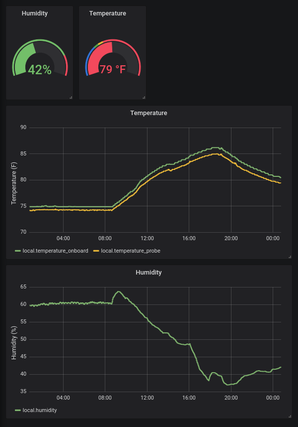

# demtemps

## Installing Graphite and Grafana

I modified [this guide](https://www.linode.com/docs/uptime/monitoring/install-graphite-and-grafana/) for much of this. You will want to do this on a Linux machine. Technically it should be possible on Windows or Mac OS by using Docker, but I've always struggled to make those work well.

1. Install [Docker](https://www.docker.com/) and [Docker Compose](https://docs.docker.com/compose/). Docker is not strictly necessary, but it makes the next steps much simpler.
1. Run `mkdir ~/grafana && cd ~/grafana`. Copy the following YAML spec into `docker-compose.yml` in the folder you just made. ```yaml
version: "3"
services:
  grafana:
    image: grafana/grafana
    container_name: grafana
    restart: always
    ports:
      - 3000:3000
    networks:
      - grafana-net
    volumes:
      - grafana-volume

  graphite:
    image: graphiteapp/graphite-statsd
    container_name: graphite
    restart: always
    ports:
      - 2003:2003
    networks:
      - grafana-net

networks:
  grafana-net:

volumes:
  grafana-volume:
    external: true
```
1. Run `docker volume create --name=grafana-volume`.
1. Run `docker-compose up -d`.
1. Run `docker ps` and confirm that there are two containers with status `Up`.
1. Navigate to `localhost:3000` in a browser. Log in with `admin`, `admin`.
1. Add Graphite as a data source. The URL should be `http://graphite:8080`. You can't visit this URL in your browser because `http://graphite` only resolves to graphite within the Docker environment. Neat!
1. Set your password to something more reasonable.
1. Confirm that if you reboot your computer, Graphite and Grafana are automatically started. If not, it is probably because Docker is not automatically started, since the two services defined above have `restart: always`.

## Feeding data into Graphite

[Official docs here](https://graphite.readthedocs.io/en/latest/feeding-carbon.html). Graphite does not collect data for you. Instead, you have to send it data. Fortunately, this is not too tough. Send a newline-delimited message over TCP to port 2003 on your computer with the following form: `metric_name value timestamp`. `metric_name` can have periods to delimit namespace, for instance the scanning fridge's 3K temperature might be `scanning.3K_temperature`.

You can send the data using bash with code like this (from the docs). I had to do `nc -q0 ${SERVER} ${PORT}` or else it waited forever for more input.

```bash
PORT=2003
SERVER=graphite.your.org
echo "local.random.diceroll 4 `date +%s`" | nc ${SERVER} ${PORT}
```

The following python code will also do. You will want to handle exceptions.

```python
import socket
import time

s = socket.socket(socket.AF_INET, socket.SOCK_STREAM)
# connect can fail. Catch the exception and gracefully handle it if necessary.
s.connect(('server.ip.here', 2003))
# send may not send all the data at once.
# See https://docs.python.org/3/howto/sockets.html for deets.
s.send(bytes(f'local.random.diceroll 4 {int(time.time())}\n'))
# Please close your sockets.
s.close()
```

## Example data feeding

For example, on the graphite computer itself I have plugged in a temperature and humidity sensor. I can connect to the device using `pyvisa` and query its sensors, then print out data formatted in Graphite's style. The unmodified code is this, called `get_temp_hum.py`.

```python
#!/usr/bin/env python3

import time
import visa

rm = visa.ResourceManager('@py')
inst = rm.open_resource('USB0::4883::33016::M00423437::0::INSTR')

temp_onboard = float(inst.query('SENS1:TEMP:DATA?').strip()) * 9/5 + 32
temp_probe   = float(inst.query('SENS3:TEMP:DATA?').strip()) * 9/5 + 32

hum  = float(inst.query('SENS2:HUM:DATA?').strip())
t    = int(time.time())

print(f'local.temperature_onboard {temp_onboard:.3f} {t}')
print(f'local.temperature_probe {temp_probe:.3f} {t}')
print(f'local.humidity {hum:.3f} {t}')
```

Then, I have a crontab that pipes this into netcat as above: `* * * * * /home/dgglab/get_temp_hum.py | nc -q0 localhost 2003`. The `*`s at the beginning means it runs every minute.

Next, I went onto Grafana, created a dashboard, and played around with settings to get this:


